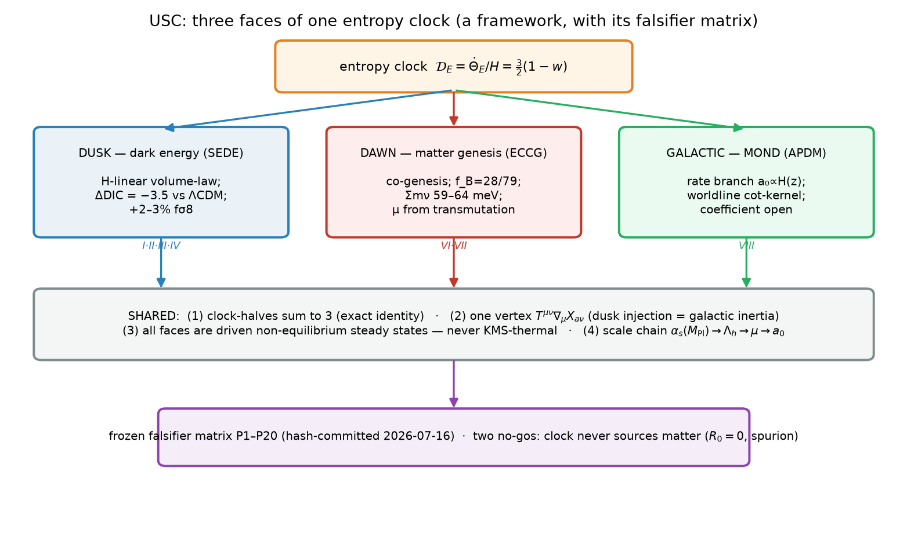

# Unified Structural-Entropy Cosmogenesis: A Falsifiable Framework Linking Dark Energy, Matter Genesis, and Galactic Dynamics

**Stilian Pandev** ([ORCID: 0009-0005-8153-071X](https://orcid.org/0009-0005-8153-071X))

*Independent researcher — stilianpandev@gmail.com*

*Preprint — consolidation of the USC-I/II/IV program documents; supersedes them as framed. Companion papers: the dark-energy data analysis (SEDE full-likelihood campaign) and the glueball/LRD seeding assessment. All numerical claims reproduce from scripts in the accompanying repositories.*

---

## Abstract

We present Unified Structural-Entropy Cosmogenesis (USC) as what it is: **a framework of three faces sharing one entropy clock, presented together with its pre-registered falsifier matrix** — not a single theory that explains dark energy, the matter asymmetry, and galactic dynamics from one mechanism. The shared object is the dimensionless clock rate $\mathcal{D}_E = \dot\Theta_E/H = \tfrac{3}{2}(1-w)$, the logarithmic rate of change of the ratio of the horizon's area-law to volume-law entropy counts. Two structural no-go results, proven within the program itself, bound what the clock can do and are stated here up front rather than buried: **(i)** every derivative coupling of the entropy arrow to the matter-genesis condensate phase is even under the $\mathbb{Z}_2$ vacuum map $\psi\to\psi+\pi$, so the arrow's per-domain selection of matter over antimatter is exactly zero ($R_0 = 0$); **(ii)** no arrow-tagged $\mathbb{Z}_2$-odd operator can rescue this, because any symmetry that admits it also admits its bare Lagrangian-sign counterpart, which dominates by a large factor ($\gtrsim 2\times 10^5$ in the companion spurion analysis; its parametric origin is developed there) (spurion neutrality). The clock therefore never sources matter (save the razor-thin Candidate C, which biases a genuine non-compact current and so evades the no-gos); it is a Sakharov *diagnostic* at the dawn and dynamical only at the dusk. What survives, and what this paper organizes, is: a dark-energy face (SEDE) that is a symmetry-constrained, structure-gated $H$-linear model statistically consistent with $\Lambda$CDM, with a mild same-direction pull ($\Delta\mathrm{DIC} = -3.5$ pre-lensing, robust part $\Delta\langle\chi^2\rangle \approx -3.0$), eroded to $\Delta\chi^2 = -2.3$ once the direct Planck lensing ($\phi\phi$) likelihood is folded in — about a third of the high-$\ell$ gain being consistent with the absorbed $A_{\rm lens}$ systematic — and predicting a $+2$–$3\%$ $f\sigma_8$ enhancement; a matter-genesis face (ECCG) surviving only as a pre-inflationary initial-condition theory with a derived baryon-transfer fraction $f_B = 28/79$ and a razor-thin clock-baryogenesis alternative squeezed to normal ordering with $\Sigma m_\nu = 59$–$64$ meV; a galactic face whose density branch is excluded at $\approx 17\sigma$ by high-$z$ kinematics (conditional on the published MUSE pipeline; see P14) and whose surviving rate branch, $a_0 \propto H(z)$, now has a partially derived worldline mechanism whose modification of inertia is necessarily a fluctuation (noise-sector) effect; and a scale sector in which hidden-sector dimensional transmutation lands the dark-energy amplitude $\mu$ in the right decade with zero new continuous parameters. The three faces share one exact cross-identity (the clock halves sum to 3 — this sum is definitional given the two clock definitions $\mathcal{D}_E = \tfrac{3}{2}(1-w)$ and the galactic clock $\tfrac{3}{2}(1+w)$, and holds for any $w$; the empirical content is not the sum rule but the shared-$w$ / internal-donor premise, which a measured deviation would actually test), one interaction vertex ($T^{\mu\nu}\nabla_\mu X_{a\nu}$, carrying both the dusk energy injection and the galactic inertia channel), and one thermodynamic character (all are driven non-equilibrium steady states — never KMS-thermal). The dawn is a set of three mutually exclusive horns with a decision table; the whole framework is frozen in a twenty-entry falsifier matrix (P1–P20, hash-committed 2026-07-16) with named double-kill clauses. The parameter ledger is stated honestly: equal continuous count to $\Lambda$CDM, plus one discrete postulate ($\Delta = 1$), one prescription ($\gamma$), one measurable perturbative parameter ($b$), and one environmental sign bit. No individual face is mechanistically new — the $H$-linear dark-energy law is the Urban–Zhitnitsky / entropic-cosmology law (reached independently from QCD contact terms and from horizon thermodynamics), the co-genesis is of the Affleck–Dine / darkogenesis class, and $a_0 \propto H$ is the long-known rate branch; USC's currency is therefore not economy or any single mechanism but its *structural* results — the two no-go theorems, the joint cross-constraint, and the pre-registered falsifier matrix.

**Keywords:** dark energy; horizon thermodynamics; baryogenesis; asymmetric dark matter; modified inertia; MOND phenomenology; non-equilibrium effective field theory; pre-registration.

---

## 1. Introduction

**Figure 1.** The USC framework. One entropy clock $\mathcal{D}_E=\tfrac{3}{2}(1-w)$ drives three physical faces — dusk (dark energy), dawn (matter genesis), galactic (MOND) — which share one exact cross-identity (clock halves sum to 3), one interaction vertex ($T^{\mu\nu}\nabla_\mu X_{a\nu}$, carrying both the dusk injection and the galactic inertia channel), one thermodynamic character (all driven non-equilibrium, never KMS-thermal), and one scale chain. Two no-go theorems bound the clock (it never sources matter: $R_0=0$, spurion). The whole is frozen in the P1–P20 falsifier matrix. Paper numbers per face are shown.

### 1.1 Three phenomena, three programs

Three of cosmology's open problems are conventionally treated by disjoint physics:

1. **Dark energy.** A smooth component with $w \approx -1$ dominates the late universe; its scale confronts the vacuum estimate by $\sim 10^{120}$.
2. **Matter genesis.** The baryon asymmetry $\eta_B = 6.1\times 10^{-10}$ and the dark-matter abundance $\Omega_{\rm DM}/\Omega_b = 5.36$ require new physics satisfying the Sakharov conditions [@Sakharov:1967dj; @Cline:2006ts], and their $O(5)$ ratio hints at a common origin.
3. **Galactic dynamics.** Rotation curves obey the radial-acceleration relation (RAR) with a characteristic scale $a_0 \approx 1.2\times 10^{-10}\,\mathrm{m\,s^{-2}} \approx cH_0/2\pi$ [@Milgrom:1983ca; @Milgrom:2020cch] — a coincidence with the cosmological horizon that dark-matter-only fits do not explain.

Three research programs address these separately: **SEDE** (Structural Entropy Dark Energy: $\rho_{\rm DE}$ as the conjugate thermal energy of a volume-law cosmic-horizon entropy, gated by structure growth), **ECCG** (Entropy-Clock Counter-rotating Co-genesis: baryons and asymmetric dark matter from two counter-rotating condensates receiving a CP-odd impulse at a first-order transition at $T_n \approx 3\times 10^{12}$ GeV), and **APDM** (the MOND scale $a_0$ as a dark-energy clock read by galaxies). All three, independently, are organized around the same variable, built on the horizon-thermodynamic tradition that reads gravitational dynamics off entropy balance [@Jacobson:1995ab; @Padmanabhan:2012ik; @Padmanabhan:2014jta]: the horizon-entropy clock

$$
\Theta_E = \ln\frac{S_H}{S_{\rm bulk,H}} = \ln\frac{3H}{4Gs},
\qquad
\mathcal{D}_E \equiv \frac{\dot\Theta_E}{H} = 3 + \frac{\dot H}{H^2} = \frac{3}{2}\,(1-w),
$$

the logarithm of the ratio of the horizon's area-law count $S_H = \pi/GH^2$ to the volume-law count $S_{\rm bulk,H} = \tfrac{4\pi}{3}sH^{-3}$. The clock rate runs monotonically from $\mathcal{D}_E = 1$ (radiation era, the ECCG epoch) through $3/2$ (matter) to $3$ (the de Sitter attractor, the SEDE limit); the choice between the two counts (Barrow index $\Delta = 0$ vs $\Delta = 1$ [@Barrow:2020tzx]) is SEDE's entire subject, and $a_0(z)$ tracks the complementary combination $\tfrac{3}{2}(1+w)$. Promoting a $w$-derived combination to a cross-sector diagnostic is the statefinder [@Sahni:2002fz] / $Om$ [@Sahni:2008xx] tradition; what is specific to USC is the cross-face falsifier structure, not the variable.

### 1.2 What "unification" means here — and what it does not

Unifying subsets of these phenomena from a single object has ample precedent: unified dark fluids (Chaplygin gas) join dark energy and dark matter [@Bento:2003dj]; superfluid dark matter joins dark matter and MOND phenomenology [@Berezhiani:2015bqa; @Berezhiani:2015pia]; dipolar dark matter joins all three of dark energy, dark matter, and MOND [@Blanchet:2008fj; @Blanchet:2009zu]; and a cosmological "wetting transition" joins dark energy, dark matter, and baryogenesis [@Brandenberger:2019jfh]. The nearest neighbor to the present entropy-clock reading is Verlinde's emergent gravity [@Verlinde:2016toy], which likewise derives both dark energy and an apparent-dark-matter phenomenology from the competition of horizon area-law and volume-law entropy; USC differs in that its clock is a *diagnostic* variable running across three sharply distinguished faces bound by a frozen falsifier matrix, rather than a single emergent-gravity force law, and — crucially — it proves (below) that this clock *cannot* source the matter asymmetry. An earlier round of this program advertised the strong claim: *one clock does both jobs* — the entropy arrow that becomes dark energy at the dusk selects matter over antimatter at the dawn. **That claim is false, by the program's own theorems, and this paper does not make it.** Two no-go results close it:

- **The $R_0 = 0$ theorem**, derived (proven within the stated EFT). The matter/antimatter choice in ECCG is the $\mathbb{Z}_2$ map $\psi \to \psi + \pi$ on the relative condensate phase. The entropy-arrow operator $c\,\partial_\mu\Theta_E\, f_\psi^2 \partial^\mu\psi = c\,\dot\Theta_E f_\psi^2\dot\psi$ — and *any* derivative coupling of the arrow to $\psi$, at any order — is invariant under that map (a constant shift leaves $\dot\psi$ unchanged). The ensemble therefore remains exactly $\mathbb{Z}_2$-symmetric: the per-domain selection is $R_0 = 0$, not the $R\approx 6$ of the original chain nor the $R_0 \sim 10^{-5}$ of a rebuilt version. Confirmed numerically at $100\times$ the sensitivity at which a (forbidden) genuinely odd tilt selects cleanly.
- **The spurion-neutrality no-go**, also derived. Nor can the arrow *tag* a $\mathbb{Z}_2$-odd operator: any symmetry structure that admits an arrow-tagged odd operator also admits its bare, Lagrangian-sign counterpart, which dominates the arrow-tagged piece by a large factor ($\gtrsim 2\times 10^5$ in the companion spurion analysis; its parametric origin is developed there) [@Dasgupta:2018eha]. The sign selected would then be a Lagrangian parameter, not the arrow.

What the clock's coupling *does* do at the dawn is spontaneous baryogenesis [@Cohen:1987vi] — ECCG's own abandoned direct source, with yield $\lesssim 10^{-11}$, below observation, and with sign set by a coupling constant. The single-source structure of any clock-driven cogenesis is itself constrained by a further result (**the generalized single-source theorem**, §8): the chemical potential $\mu = H/2\pi$ cancels in the baryon-to-dark yield ratio, leaving a ratio of two operator rates of which only the neutrino-mass-anchored one is calculable — so a clock-driven dawn can be *$\eta_B$-calculable or $m_X$-sharp, but provably not both*. This conclusion runs directly counter to recent proposals that source the baryon asymmetry from entropy production and horizon thermodynamics [@Mandel:2026azt; @Luciano:2025fqg]: where those frameworks treat the entropy arrow as a viable baryogenesis engine, USC's $R_0 = 0$ and spurion-neutrality theorems establish that — within its stated EFT — the clock cannot select matter dynamically at all, and the near-terminological collision at the dawn face is in fact a mechanistic contradiction.

Given all this, **"unification" in this paper means exactly three things**, none of which is a shared engine:

1. **Shared structures.** One clock identity, one interaction vertex, one non-equilibrium thermodynamic character across all faces (§7).
2. **Cross-constraints.** Quantities free in one face are fixed by another ($\omega_b \equiv \eta_B/2.74\times10^{-8}$; SEDE's assumed cold dark sector is ECCG's relic; the dark-energy amplitude $\mu$ is a candidate transmutation output), so the union can fail in ways no face can alone (§10).
3. **Joint falsifiers.** A frozen, hash-committed matrix of twenty predictions with decision rules and explicit double-kill clauses (§9).

The framework has *branches* — three dawn horns, two dark-energy realizations, one surviving galactic branch, two $\mu$-origins — and we present them as exclusive alternatives with a decision table (§8), not as a single model. An internal over-claim analysis of the predecessor documents found, correctly, that the headline was self-refuted and the branching un-falsifiable as advertised; the present paper is the reframe those findings demand. Throughout, we are explicit about which quantities are derived (computed and reproducible), which are fixed by matching data or a target number (not independent predictions), and which are postulated (assumed; falsifier targets rather than results) or conjectured (motivated, with stated failure modes).

---

## 2. The dusk face: structure-gated $H$-linear dark energy (SEDE)

### 2.1 The model

SEDE's dark energy is the thermal energy of the cosmological apparent horizon, activated by structure growth:

$$
\rho_{\rm DE} = T_{AH}\, s_{\rm grav}\, f_{\rm sat}(z),
\qquad
T_{AH} = \frac{H}{2\pi},
\qquad
f_{\rm sat} = \frac{1 - e^{-\gamma D^2(z)}}{1 - e^{-\gamma}},
$$

with $s_{\rm grav} = s_0$ a constant volume-law entropy density fixed by flatness, $D(z)$ the background (GR, $\mu=1$) linear-growth amplitude — a functional of the expansion history alone, so the gate is fixed by the background and does *not* loop through the perturbation-sector fifth force — and $\gamma \approx 1.5$ from halo binding ($E_{\rm bind}\propto M^{5/3}$). The functional building blocks are not free: the horizon temperature is the Gibbons–Hawking value (derived from Euclidean regularity), the relation $\rho = Ts$ is derived to hold on-shell in the energy-injection frame, and the gate is derived as the Avrami–Kolmogorov coverage law of horizon-entropy activation by the structure-collapse current. The one input the model does not derive is the counting itself: **that the horizon entropy is volume-law (Barrow $\Delta = 1$) rather than area-law ($\Delta = 0$) is a discrete postulate** — the namesake "structural entropy" is an interpretation, and the forecasts below target exactly this postulate. The background closes as a fixed point, $E^2 = \Omega_m(1+z)^3 + \Omega_r(1+z)^4 + \Omega_{\rm DE0} f_{\rm sat}E$ — an otherwise standard-GR Friedmann equation with $\rho_{\rm DE}$ added as a single holographic-DE fluid, *not* a Barrow-modified-gravity background (so $\Delta$ multiplies $\rho_{\rm DE}$ alone and the modified-gravity Barrow/BBN bounds do not apply) — giving $w_0^{\rm today} = -0.996$, CPL $(w_0, w_a) \approx (-0.984, -0.109)$, a $w=-1$ crossing at $z_{\rm cross} = 0.191$ in the injection frame, and a true minimum $w_{\rm min}\approx -1.16$ near $z\approx 20$ where $\Omega_{\rm DE}\lesssim 3\%$, all derived.

The model's sharpest structural commitment is the **growth–expansion lock**,

$$
1 + w = \tfrac{1}{3}\left[\,2\lambda\varepsilon - \frac{d\ln f_{\rm sat}}{d\ln a}\right],
\qquad \lambda = \tfrac12,
$$

an exact zero-free-function identity of the action, derived and verified to four decimals in a self-consistent solve. It ties $w(z)$ to the growth history $D(z)$ and is the discriminant against the nearest-neighbor entropic model (GREA [@Garcia-Bellido:2024qau]): both cross $-1$, but GREA's entropy production is expansion-timed while SEDE's is structure-timed.

### 2.2 The corrected non-equilibrium story

An earlier framing derived the whole dissipative sector from a single dynamical KMS symmetry at $T_{AH}$, with "one inequality $\zeta > 0$ = ghost-freedom = second law = fluctuation–dissipation noise." **The fluctuation half of that claim is retracted.** A direct computation compares the KMS-at-$T_{AH}$ fluctuation amplitude for $\rho_{\rm DE}$ ($\sim 10^{-61}$ RMS) with the actual fluctuation sourced by the cold structure bath ($\sim 3\times 10^{-4}$): the FDT lock $\langle\xi\xi\rangle = 2\zeta T_{AH}$ fails by $\sim 10^{57}$. The bath that drives the gate is cold structure, whose fluctuations descend from inflation ($A_s$), not from the $10^{-33}$ eV horizon temperature. The correct statement, adopted throughout this paper, is:

> **The dusk is a driven non-equilibrium steady state (NESS): its *mean* is horizon-thermal ($\rho = Ts$, $T_{AH} = H/2\pi$ — these survive and fix the $H$-linear background), while its *noise* is athermal and structure-sourced. $\zeta > 0$ is the second law of a driven system (the gate opens monotonically — a theorem extending to the infinite future), not a thermal-FDT statement.**

Ghost-freedom and causality then require the crossing to be realized in the **injection frame**: within the Schwinger–Keldysh effective field theory of dissipative fluids [@Crossley:2015evo], the coupling sits on the $a$-leg, acting as an energy injection $Q = c\,\nabla\!\cdot\!\mathcal{J}$ into a $p_{\rm id} = 0$ dark fluid (enthalpy positive at all $k$ and all epochs), rather than as a single-fluid bulk-viscous stress, whose Israel–Stewart characteristic speed diverges at the crossing. The injection is $O(3)$, not perturbative ($Q/H\rho_{\rm DE}\approx 3$–$3.4$), and its donor is provably internal to the dark sector: a matter donor would (as we derive) drive $\rho_m(z{=}0)$ negative by 233%. In the injection frame, a locally sourced $\delta Q$ is pressure-suppressed by $(aH/k)^2$, confining the dark-energy *clustering* response to horizon scales: we derive $\delta_{\rm DE}/\delta_m \approx 6$ at $k\approx aH$ but $\lesssim 7\times 10^{-5}$ at $k = 0.1\,h/$Mpc.

### 2.3 Empirical status

The finite-$k$ phenomenology is computed through an independent modified-gravity Boltzmann code from a conservative kinetic-gravity-braiding reconstruction whose sixteen coefficients are slaved to the single background (they carry no independent freedom, but the reconstruction is a *reconstruction*, not a derived action — see the ledger, §10). The derived results are: ghost/gradient/tachyon-stable; $c_T = 1$, zero slip; $\mu_\infty = 1.05$; $+2.6\%$ matter power at $k = 0.1\,h$/Mpc; $\sigma_8$ ratio $1.013$. **The model raises late-time growth; we make no claim to ease the $S_8$ tension** (an earlier $\sigma_8 = 0.76$ claim is retracted).

The model comparison now rests on real likelihoods. The full DESI-DR2 + Pantheon+ + Planck (real high-$\ell$ TTTEEE) production MCMC, marginalized at equal parameter count, gives

$$
\Delta\mathrm{DIC}(\mathrm{SEDE} - \Lambda\mathrm{CDM}) = -3.5
$$

— statistically consistent with $\Lambda$CDM, with a mild same-direction pull ($\Delta\mathrm{DIC} = -3.5$ pre-lensing, robust part $\Delta\langle\chi^2\rangle \approx -3.0$), eroded to $\Delta\chi^2 = -2.3$ once the direct Planck lensing ($\phi\phi$) likelihood is folded in — about a third of the high-$\ell$ gain being consistent with the absorbed $A_{\rm lens}$ systematic. The pull lives in Planck's high-$\ell$ lensing (the direction of the known mild $A_{\rm lens}>1$ preference) and survives marginalization; these numbers are derived (see the companion data paper). This replaces the corpus's earlier compressed-CMB/SH0ES-driven $\Delta\mathrm{DIC}$ (the companion's compressed $-4.68\to-3.17$), which was correctly criticized; the number was approximately right, its provenance was not.

Two forward predictions are registered: **a $+2$–$3\%$ scale-independent $f\sigma_8$ enhancement through the RSD range** (falsified if DESI DR3 + Euclid see no enhancement; note the sign is *opposite* to what would ease $S_8$ — this is a risky prediction, not an accommodation), and **a $-7.6\%$ low-$\ell$ ISW suppression** ($C_\ell^{TT}(\ell{=}2) = 0.9236$), with any gate–matter cross-correlation at $k\gtrsim 0.01\,h$/Mpc killing both realizations at once. On the at-risk register: SEDE's $(w_0, w_a)$ sits $2.7$–$4.2\sigma$ from the DESI DR2 CPL centers, covering only 5–14% of the $\Lambda$CDM$\to$DESI displacement. **If DR3 confirms the DR2 central values at higher significance, SEDE is falsified alongside $\Lambda$CDM, not rescued by proximity.**

---

## 3. The dawn face: counter-rotating co-genesis (ECCG)

### 3.1 The mechanism and what survives

ECCG generates the baryon and dark asymmetries together — a co-genesis in the tradition of asymmetric-dark-matter and Affleck–Dine cogenesis models [@Shelton:2010ta; @Cheung:2011if]: two counter-rotating condensates $\Phi_{V,D}$ under a shared $U(1)_{\mathcal Q}$ ($Q_V = -Q_D$ exactly) receive a CP-odd impulse from a first-order hidden-sector transition at $T_n \approx 3.17\times 10^{12}$ GeV, storing equal and opposite charge that transfers to visible baryons and dark fermions. The closure is $\eta_B = 7.04\, f_B\, Y_Q^{\rm prim} (D_{\rm perc}/\Delta_S)$, and the dark-matter mass is set by the co-genesis ratio:

$$
m_X = \frac{\Omega_{\rm DM}}{\Omega_b}\, m_p\, f_B \approx 1.78\ \mathrm{GeV}
\qquad (1.63\text{–}1.78),
$$

with the transfer fraction now **calculated** and derived: $f_B = 28/79 = 0.354$ — the clean chemical-equilibrium limit of the high-scale portal (PMNS-independent, washout $4\times 10^{-5}$); the earlier $f_B = 0.259$ and $m_X = 1.30$ GeV hid a portal-fragile sphaleron-timing factor and are superseded.

The no-go theorems of §1.2 close every *dynamical* sign-selection channel, and they exposed a genuine problem in ECCG itself, established by a simulation-verified derivation: with Kibble-random 50/50 $\mathbb{Z}_2$ vacua ($\sim 10^{13}$ domains per horizon) and the verified sign-flipping impulse, adjacent matter and antimatter patches annihilate to net $\eta \approx 10^{-16}$–$10^{-14} \approx 0$; a $\mathbb{Z}_2$-odd tilt could break the tie only above the stiff-pin threshold $m_{\rm odd}/H \gtrsim 216$–$630$, versus the benchmark's $m_1/H = 0.235$ — short by $10^5$–$10^7$. **The only internal cure is a pre-inflationary hard-breaking condensate**, and a dedicated derivation shows it survives its own constraints: $\kappa_2$ descends from the hidden SQCD vacuum condensate (confined throughout inflation), $\psi$ is a heavy spectator ($m_2 \gg H_{\rm inf}$), so the feared baryon isocurvature is exponentially suppressed, and $\eta_B = 6.1\times 10^{-10}$ is recovered in a nonempty window $T_{\rm RH}\in(3.2, 9)\times 10^{12}$ GeV $\times$ $H_{\rm inf} < 1.16\times 10^{9}$ GeV. The reheating-robustness check further shows the cure's true threshold is the flavon scale $v_S$, not $\Lambda_H$ — comfortably satisfied — and surfaces a new falsifier: the economical single-flavon branch B ($v_S = 2.44\times 10^{13}$ GeV) predicts a neutron EDM within roughly an order of magnitude of the current bound.

The price of the cure is steep and is stated as such: $r \le 2\times 10^{-11}$ (no primordial tensors, ever), the loss of the $\sim 700$ Hz wall gravitational-wave signature, and — decisively — **the matter sign becomes an environmental initial condition.** ECCG survives only as a pre-inflationary *initial-condition* theory: it explains the magnitude relationship between the baryon and dark sectors and predicts a sharp dark-matter mass, but it inputs, rather than explains, that we live in a matter universe. $\eta_B$'s magnitude remains a fit through the CP combination $m_3/H = 1.58$ (a stationary-entropy-production derivation was attempted and, as a derived negative result, failed).

### 3.2 The Candidate-C squeeze

The one surviving clock-driven alternative (evading the no-gos because it biases a genuine non-compact current, not a compact vacuum) is spontaneous B−L genesis [@Cohen:1987vi]: $\mu = c\,\dot\theta = H/2\pi$ acting through the Weinberg operator, whose coefficient *is* the measured neutrino mass, giving $\eta_B \propto T_{\rm RH}^2\,\Sigma m_i^2$, derived at Boltzmann level with stated $O(1)$ systematics. Confronting this line with the real $\Delta L = 2$ washout Boltzmann equations, the neutrino-ordering floors, the DESI ceiling, and the res-(iv) reheating window squeezes the hybrid to a razor-thin region:

$$
\boxed{\ \text{normal ordering},\quad \Sigma m_\nu = 59\text{–}64\ \mathrm{meV},\quad T_{\rm RH}\approx 3.3\times 10^{12}\ \mathrm{GeV}\ }
$$

surviving, as derived, in only 0.3–1.3% of the $O(1)$-coupling prior volume. This is presented as a *squeeze, not a parameter-free prediction*: the honest statement is that Candidate C's viable region sits exactly where DESI is actively cutting, and one DR3 tightening — or a confirmed inverted ordering — falsifies it with data external to all three programs.

### 3.3 Honest lattice status

The first-order character of the hidden transition is supported by a **validated pipeline producing a preliminary number**: one volume, one lattice spacing, $1.3\sigma$ against one published reference point, with one input digitized from a figure. A paper-level claim of "first-order confirmed by lattice" would overstate this; the converged study (nine volume/spacing combinations, susceptibility-scaling decision rule) is specified as an external project (§11). A crossover outcome would remove the out-of-equilibrium leg and falsify the dawn mechanism as constructed. Likewise $v_w = 0.58$ is a leading-order ballistic estimate awaiting full transport.

---

## 4. The galactic face: the rate branch and the worldline mechanism

### 4.1 The branch discrimination

Two live hypotheses tie $a_0$ to cosmology: the **density branch** $a_0\propto\sqrt{\rho_{\rm DE}}$ (APDM's superfluid reading — $a_0$ *falls* with $z$) and the **rate branch** $a_0\propto H(z)$ ($a_0$ *rises*). Against the published MUSE high-$z$ fit $a_0(z) = (1.00\pm0.04) + (1.59\pm0.11)z$, the frozen templates over $z = 0.33\to1.44$ give: **density branch excluded at $\approx 17\sigma$** (a sign error no amplitude freedom repairs); rate branch favoured in sign, $+4.4\sigma$ too shallow, a deficit absorbable by the astrophysical transfer $B(z)$ — all derived from the frozen templates. Two honesty flags are integral to this claim: (i) the exclusion is against a *template* using the *published* fit, and a reproduction attempt found the raw released kinematics radius-degenerate ($\mathrm{corr}(r_{\rm max}, z) = 0.87$) — the rising trend is pipeline-mediated, so the verdict is **conditional on the MUSE pipeline** and the decisive independent protocol (matched $M_*$/morphology bins, matched radius sampling in $R_{\rm eff}$ units) is frozen as falsifier P14; (ii) the $H$-vs-density Tully–Fisher redshift test has precedent (Limbach–Psaltis–Özel 2008 [@Limbach:2008aa]), and the novelty claimed here is the two-branch discrimination within one framework, not the test itself.

### 4.2 The worldline results

The rate branch long had no mechanism. The current state is a partial derivation with sharply posed remainders:

- **The acceleration coupling is exact**, as derived directly. For a point particle, integrating the USC vertex by parts on the worldline gives $\int d^4x\, T^{\mu\nu}\nabla_\mu X_\nu = -m\int d\tau\, a^\nu X_\nu$: the displacement field couples directly to the acceleration vector. Inertial worldlines decouple identically — the equivalence-principle/Newtonian limit is protected structurally, and the channel is acceleration-selective, exactly what a modified-inertia mechanism requires. (A competing number-current coupling $c\,\partial\theta\cdot\mathcal{J}$ is proven inert on worldlines — a total derivative, by the same logic as the dawn refutation.)
- **The influence-functional kernel is closed-form**, derived in a conformal-scalar proxy model. On the uniformly accelerated (Deser–Levin) trajectory in de Sitter, with the pulled-back Wightman function thermal at $\kappa = \sqrt{a^2 + H^2}$, the second-order kernel is exactly $(a/4\pi)\cot(\pi a/\kappa)$. The conjectured Green-function $4\pi$ **appears in the kernel normalization** — no longer numerology — while the interpolation function is $\cot$-type, *not* the naive temperature-excess $\Delta T(a)$ (which, raw, gives $a_0 = 2cH$, off by $11\times$ and hereby discarded).
- **The modification is noise-sector physics**, as we derive. The dispersive/dissipative split shows the retarded (commutator) kernel is light-cone-supported and hence purely local on a timelike worldline; the entire $a$-dependent, $H$-tilted structure lives in the Keldysh (noise) kernel. **Any inertia modification from this channel is a fluctuation-induced, stochastic effect, not a classical self-force** — cohering exactly with the framework-wide NESS character (§7). The remaining calculation is precisely posed: a Langevin worldline problem with multiplicative noise correlator $\propto a^2\times[\cot$-kernel$]$, plus the true vector structure of $X_\nu$ and finite acceleration episodes to regulate the eternal-trajectory pathology. The $a_0$ coefficient is therefore **open**: $a_0(0) = cH_0/2\pi\times O(1)$ with $O(1)\in[0.88, 1.16]$ is fixed by matching, not derived.

Two coefficient-independent predictions survive regardless: **P14** ($a_0(z)\propto H(z)$, template ratio $1.89\pm0.03$ over the MUSE window) and **P15, gate independence**: $a_0$ carries no $f_{\rm sat}$ factor, so $a_0(z{=}3)/a_0(0)\approx 4.5$ even though $\Omega_{\rm DE}(z{=}3)\approx 3\%$ — **MOND phenomenology persists and strengthens at high redshift where dark energy is off**, maximally separating this realization from any $a_0\propto\rho_{\rm DE}^n$ model in JWST-era $z\gtrsim 2$–3 rotators. Existing high-$z$ rotation-curve / Tully–Fisher analyses [@Limbach:2008aa] already bound a rising $a_0(z)$; the prediction must survive them, and we register this as a live threat. On circular orbits the realization predicts the zero-shape-freedom interpolation $g_{\rm obs} = \sqrt{g_{\rm bar}^2 + a_0 g_{\rm bar}}$, sitting within 0.057 dex of the empirical fit with a specific signed residual pattern — a match to the data, not an independent prediction.

---

## 5. The scale sector: transmutation, the glueball horn, and the 52 MeV pincer

The dark-energy amplitude $\mu = 28.5$ MeV (defined by $\rho_{\rm DE} = \mu^3 H\, f_{\rm sat}$) is, in $\Lambda$CDM terms, the successor of $\Lambda$: one fitted scale. The scale sector asks whether it has an origin.

**Dimensional transmutation**, derived at the stated order: a hidden $SU(3)$ with $N_f = 6$, mirror-unified with the visible coupling at $M_{\rm Pl}$ ($\alpha_h(M_{\rm Pl}) = \alpha_s(M_{\rm Pl}) = 1/53$ at two loops), runs down to a confinement scale $\Lambda_h$ in the band **28–105 MeV** across loop order and scheme — bracketing both the bare target ($\mu = 28.5$) and the UZ-corrected one ($6^{1/3}\mu = 51.9$) **with zero new continuous parameters.** This is an order-of-magnitude success (Planck-scale unification landing on the dark-energy decade), honestly a band, not the earlier "12% alignment," which dissolved under two-loop/scheme spread.

**The load-bearing conjecture**: converting $\Lambda_h$ into $H$-linear vacuum energy requires the Urban–Zhitnitsky/Ohta mechanism, $\Delta\rho \sim H\,\chi_{\rm top}/m_G \sim H\Lambda_h^3/6$ — the topological (contact-term) sector's sensitivity to the causal horizon. This is **a conjecture, contested in the literature**, and it is the single load-bearing assumption of the route. Two things make it worth registering rather than discarding: (i) the framework's own no-go (the volume-law horizon count cannot be entanglement of local QFT degrees of freedom) demands *nonlocal* horizon degrees of freedom, and the contact term is precisely a nonlocal, non-propagating, boundary-sensitive object — the unique known candidate matching both the $\rho\propto H\Lambda^3$ form and the nonlocality requirement; (ii) it has a **non-cosmological lattice discharge test** (P20): the pure-glue $SU(3)$ vacuum energy must carry a finite-volume term $\rho_{\rm vac}(L) - \rho_{\rm vac}(\infty)\propto \chi_{\rm top}/(m_G L)$. A null at the relevant precision kills the mechanism, the transmutation route, and the nonlocal-dof identification together.

**The glueball horn** (dawn horn (iii), §8): if the hidden sector is pure-glue at low energy, its dark matter is the glueball, $m_G = 6\Lambda_h = 180$–$630$ MeV, with velocity-independent self-interaction $\sigma/m = 0.47/0.09/0.01\ \mathrm{cm^2/g}$ at $\Lambda_h = 30/52/105$ MeV, invisible to direct detection and to $\Delta N_{\rm eff}$ (the viable sector is matter-like before BBN — a future $\Delta N_{\rm eff}$ detection would *not* support it).

**The $\Lambda_h \approx 52$ MeV pincer**, fixed by matching rather than an independent prediction (see the companion glueball/LRD paper): cluster SIDM bounds press from above ($\sigma/m\lesssim 0.1$–$0.5$ disfavors $\Lambda_h\approx 30$), while — *conditionally*, if the JWST Little-Red-Dot black-hole seeds are shown to require SIDM gravothermal collapse — seeding presses from below ($\sigma/m\gtrsim 0.1$ excludes $\Lambda_h\approx 105$; within the plausible baryon-boost bracket, $\Lambda_h = 52$ MeV lands on the LRD abundance within a factor $\sim 2.5$ with $\sim 7\times 10^6\,M_\odot$ seeds). The two-sided squeeze selects the UZ-corrected value the dark-energy mechanism independently wants — a three-way convergence the theory did not tune for, registered as a *viability statement, not a prediction* (the abundance traverses six orders of magnitude across the honest error budget).

---

## 6. Note on realizations: injection frame vs conservative reconstruction

The dusk admits two computational realizations of the same background: the dissipative injection-frame action (§2.2) and the conservative kinetic-gravity-braiding reconstruction that the Boltzmann pipeline uses. They are equivalent at background level by construction; at the perturbative level their equivalence is the **D-5 acceptance test**: coarse-graining the conservative theory over the structure modes must generate exactly the dissipation $\zeta_{\rm res} = (1-b)\,\rho_X f'/(9H)$, where $b$ is the braiding fraction. The leading-order computation establishes the memory scale (Hubble — arising for free from the never-decorrelating growing mode, retiring the make-or-break obstruction), the functional form (matches exactly), and the magnitude (right order), all derived; the exact coefficient is reduced to one calculated factor (the separate-universe vertex, $\partial\ln q/\partial\delta_L\in[1.24, 1.65]$) and **two specified integrals** (the composite renormalization of $\sigma_R^2$ and the Kubo kernel normalization) with no missing physics (§11). The two realizations *differ* observably in $z_{\rm cross}$ ($0.19$ vs $\approx 0.016$/none) — registered as the realization discriminator P3, not hidden. The braiding fraction $b$ is a free perturbative parameter today ($\mu_0 = 0.04\pm0.22$ allows all values above the stability floor $b\ge 0.164$) but becomes measurable at $\sim 5\sigma$ by DR3+Euclid, enabling a three-way origin test (P6): $b\approx 0.206$ resurrects the visible-QCD amplitude hypothesis; any other value points to transmutation or neither.

---

## 7. Cross-structure: what the faces genuinely share

Three structural facts — the honest replacement for the retracted thermal ("one KMS symmetry") unification — hold across all faces:

**(1) The clock identity: the halves sum to 3, exactly**, as derived below. SEDE's clock reads $\mathcal{D}_E^{\rm SEDE} = \tfrac{3}{2}(1-w)$; the galactic face's $a_0$ clock reads $d\ln a_0/d\ln(1+z) = \tfrac{3}{2}(1+w)$. Their sum is 3 identically — and the identity is *exact*, not approximate, because the injection channel's donor is internal to the dark sector (§2.2): no $Q/H\rho_{\rm DE}$ correction appears. This sum is definitional given the two clock definitions $\mathcal{D}_E = \tfrac{3}{2}(1-w)$ and the galactic clock $\tfrac{3}{2}(1+w)$ — it holds for any $w$; the empirical content is not the sum rule but the shared-$w$ / internal-donor premise, which a measured deviation would actually test. The sum rule is itself a falsifier: a measured deviation is a direct detection of dark–visible energy exchange and kills the internal-donor structure.

**(2) One vertex, two faces** — derived at the dusk face, while at the galactic face its normalization is fixed by matching and remains open. The dusk's energy injection and the galactic face's inertia channel are the *same operator*: $T^{\mu\nu}\nabla_\mu X_{a\nu}$. At the dusk it injects $Q = c\nabla\!\cdot\!\mathcal{J}$ into the dark fluid; pulled back to a worldline it couples to $m\,a^\nu$ (§4.2). The framework's cosmological and galactic phenomenology ride one interaction, with the number-current alternative proven inert in both places.

**(3) The uniform NESS character: fluctuation-driven, never KMS-thermal.** Every face, examined honestly, is a driven non-equilibrium steady state: the *dusk*'s noise is cold and structure-sourced ($10^{57}$ off the KMS value; §2.2); the *dawn* has two incommensurate modular structures (plasma $T_n$ and horizon $H_n/2\pi$, ratio $\sim 10^{-7}$) and is a NESS with respect to either; the *galactic* channel's entire $a$-dependent structure is Keldysh (noise-sector) physics (§4.2), a fluctuation-induced effect in a bath with $\sim 3\times 10^{-22}$ thermal occupancy. The earlier "single dynamical KMS structure" was never right at any face; what is uniformly true is: **mean thermodynamics horizon-anchored, dissipation second-law-positive, noise athermal and state-sourced.** This is a weaker but consistent shared character, and it is what the framework now claims — a shared *structure*, not a shared engine.

We flag explicitly what is *not* claimed: $c = 1/2\pi$ as "unit coupling per KMS period" is retracted with the FDT story; the surviving $2\pi$ is the geometric Gibbons–Hawking factor in the means, and the $a_0$ normalization carrying it is fixed by matching at the 12–16% level, pending the worldline coefficient.

---

## 8. The horn structure: three exclusive dawn branches

The dawn is not one model. It is three mutually exclusive horns, bounded by the generalized single-source theorem (η_B-calculable XOR m_X-sharp; §1.2), and the framework commits to the discriminating data *now*:

| | **Horn (i)** ECCG-res-(iv) | **Horn (ii)** C² seesaw | **Horn (iii)** C + glueball |
|---|---|---|---|
| $\eta_B$ | fit ($m_3/H = 1.58$) | **derived** ($\propto T_{\rm RH}^2\Sigma m_\nu^2$) | **derived** (same channel) |
| dark matter | ADM, $m_X = 1.78$ GeV sharp | band 0.18–840 GeV | glueball, $m_G = 180$–$630$ MeV |
| $\Omega_{\rm DM}/\Omega_b$ | **explained** (co-genesis) | partial | unexplained ($Br$ dial) |
| primordial tensors | $r \le 2\times 10^{-11}$ | allowed | allowed |
| $\Sigma m_\nu$ | free | **NO, 59–64 meV** | **NO, 59–64 meV** |
| neutron EDM | branch B at current bound | — | — |
| SIDM | velocity-dependent ($\phi$, 0.86 MeV) | model-dep. | **velocity-independent**, 0.01–0.5 cm²/g |
| direct detection | invisible ($\sigma_{SI}\sim 2\times 10^{-48}$, below the $\nu$-fog) | model-dep. | invisible (no portal) |

**Decision table — what data kills which:**

- **Any B-mode detection (any $r$)** kills horn (i) outright; the dawn survives only as (ii)/(iii).
- **Inverted ordering, or a robust ceiling $\Sigma m_\nu < 59$ meV**, kills horns (ii) and (iii) the same week; the dawn survives only as (i).
- **A neutron-EDM null at $10\times$ tighter** kills horn (i)'s branch B (forcing the two-flavon branch A); a detection near the bound is positive evidence for (i).
- **A cluster exclusion of $\sigma/m > 0.1\ \mathrm{cm^2/g}$** pushes horn (iii) to $\Lambda_h\gtrsim 50$ MeV, selecting the UZ coefficient; a measured $m_X$ in the *low* band 1.63–1.70 GeV is the glueball-subcomponent hint.
- **All horns** share the absence predictions: no LISA/PTA-band transition background, no $\sim 700$ Hz wall signal (retired), standard BBN.

The horns cannot be satisfied à la carte: the master cascade (§9) shows that rising $a_0$ + $r\approx 0$ + nEDM-at-bound + $m_X = 1.78$ is a different universe from rising $a_0$ + any $r$ + $\Sigma m_\nu$-at-floor + velocity-independent SIDM. A null in one channel *selects*; coordinated nulls across channels *falsify*.

---

## 9. The falsifier matrix

The P1–P20 methodology is a deliberate transplant of the blinding and pre-registration discipline now standard in observational cosmology [@DES:2019zlw; @DESI:2024wki] — freezing predictions and decision rules before the deciding data, rather than a *sui generis* device. The framework's twenty falsifiable commitments were frozen on 2026-07-16 — before the deciding data (DESI $\Sigma m_\nu$ and DR3, LiteBIRD/CMB-S4, nEDM upgrades, cluster SIDM, JWST high-$z$ kinematics) — with a machine-readable value file committed under

`sha256(PREREGISTRATION_frozen_values.json) = a0ee6c9b080999ddc09ec77d3a83ab7be5f8a77ffca742638c43a60ed0b70595`.

Nothing in the frozen document may be edited; corrections go in dated addenda. Condensed (◆ = branch-conditional; the rule then says which branch dies, not the program):

| # | prediction | decision rule (what dies) |
|---|---|---|
| P1 | $\Delta = 1$ exactly (discrete) | $|\hat\Delta - 1| > 3\sigma$: volume law dies; intermediate $\hat\Delta$: the discreteness framework; $\hat\Delta = 0$: SEDE outright — hence the union |
| P2 | growth–expansion lock, $\lambda = 1/2$ | any significant violation kills the action (not a fit); GREA discriminant |
| P3 ◆ | $z_{\rm cross} = 0.191$ (injection) vs $\approx 0.016$/none (conservative) | measured $z_{\rm cross}$ selects the realization; GP-reconstructed $z\approx 0.46$ confirmed $>3\sigma$ kills both |
| P4 ◆ | growth amplitude by track ($\sigma_8 = 0.811$, FPAB completion) | one number must be committed before Euclid/LSST comparison |
| P5 | $+2$–$3\%$ $f\sigma_8$; $-7.6\%$ low-$\ell$ ISW; gate–matter correlation at ISW scales *only* | no $f\sigma_8$ enhancement kills the $\mu(k)$ modification; any RSD-scale gate correlation kills both realizations |
| P6 | braiding $b$ measurable ($\sigma(\mu_0)\approx 0.05$) | $b\approx 0.206$: visible-QCD origin; else transmutation or neither |
| P7 | clean early universe; **zero cosmic birefringence** | EDE/BBN speed-up detection; the ACT DR6 birefringence hint ($2.9\sigma$) is a registered live threat |
| P8 | tensors | any $r$ detection kills horn (i) |
| P9 | neutron EDM near bound (horn i, branch B) | null at $10\times$ tighter kills branch B |
| P10 | NO + $\Sigma m_\nu = 59$–$64$ meV (horns ii/iii) | IH or $\Sigma m_\nu < 59$ meV kills both clock horns |
| P11 | DM character per horn (mass target / SIDM) | cluster $\sigma/m$ selects the $\Lambda_h$ coefficient; low-band $m_X$ = subcomponent hint |
| P12 | no transition GW background (all horns) | a LISA/PTA-band FOPT signal from this epoch |
| P13 | correlated isocurvature just below Planck CDI (horn i) | wrong correlation structure |
| P14 | $a_0(z)\propto H(z)$; independent-pipeline protocol frozen | no collapse under any one-parameter $A(z)$: $a_0$ is not cosmological — the galactic face fails |
| P15 | gate independence: MOND persists at $z\gtrsim 2$–3 | weakened deep-MOND phenomenology in JWST rotators kills the inertia realization |
| P16 | zero-freedom interpolation, 0.057 dex signed pattern | $<0.05$ dex stacking either detects the pattern or kills this law (not the branch) |
| P17 | exact algebraic RAR on circular orbits; non-AQUAL EFE | curl corrections detected |
| P18 | $a_0(0) = cH_0/2\pi\times O(1)$, $O(1)\in[0.88, 1.16]$ | tightens to $\sim 10\%$ if the worldline $4\pi$ derivation closes |
| P19 | hidden sector invisible: $\Delta N_{\rm eff}\approx 0$ | a $\Delta N_{\rm eff}$ detection is *not* support and demands another origin |
| P20 | lattice: $\rho_{\rm vac}(L) - \rho_{\rm vac}(\infty)\propto\chi_{\rm top}/(m_G L)$ | null kills UZ, the transmutation route, and the nonlocal-dof identification |

**At-risk register** (tensions registered *against* the framework, before the data): SEDE at 2.7–4.2σ from the DESI DR2 CPL centers (P3 — DR3 confirmation falsifies); the MUSE $a_0(z)$ rise is pipeline-mediated (P14 conditional); the ACT birefringence hint (P7); Candidate C alive in $\le 1.3\%$ of its prior (P10).

**Double-kill clauses:** $\Sigma m_\nu < 59$ meV kills horns (ii)+(iii) simultaneously; DR3-confirms-DR2 kills the dusk *and with it all faces*; an RSD-scale gate correlation kills both dark-energy realizations at once. **The master cascade:** rising $a_0$ + $r\approx 0$ + nEDM at bound + $m_X = 1.78$ GeV = horn (i) confirmed; rising $a_0$ + any $r$ + $\Sigma m_\nu$ at floor + velocity-independent SIDM = horn (iii). These are different universes; the matrix cannot be satisfied piecemeal.

---

## 10. The parameter ledger

We make no parameter-free claim; the ledger *is* the claim. Every input, categorized against $\Lambda$CDM:

| input | $\Lambda$CDM | USC | type |
|---|---|---|---|
| $\Omega_m$, $H_0$, $\omega_b$, $A_s$, $n_s$, $\tau$ | ✓ (6) | ✓ (6) | continuous-fitted, shared — but $\omega_b$ is cross-tied: it must equal $\eta_B/2.74\times 10^{-8}$ from the dawn (costing only $\Delta\chi^2 = 0.42$; the free number relabels to $m_3/H$ in horn (i), or becomes derived in horns (ii)/(iii)) |
| $\Lambda$ / $\mu$ | $\Lambda$ (1) | $\mu$ (1) | continuous-fitted — same count; one dark-energy scale each ($\mu$ from flatness closure; candidate transmutation origin, §5) |
| $\gamma$ (gate steepness) | — | 1.5 | **prescription** (halo binding, $E_{\rm bind}\propto M^{5/3}$); not fitted; promoting it to fitted would cost $+1$ |
| $\Delta$ (Barrow index) | 0 (implicit) | **1** | **discrete postulate** — the falsifier target P1 |
| $b$ (braiding fraction) | — | free $\ge 0.164$ | **free perturbative parameter**, measurable at $\sim 5\sigma$ by DR3+Euclid (P6); the background does not fix it |
| 16 KGB reconstruction coefficients | — | — | slaved to the single background (derived, not inputs) — but the *action* is a reconstruction, not derived from a symmetry |
| $c_s^2 = 1$; $v_w = 0.58$ | — | — | prescriptions (smooth-DE closure; LO ballistic pending S-3) |
| matter sign | — | 1 bit | **environmental initial condition** — explicitly outside the theory |
| condensate content ($\Sigma, \Phi_V, \Phi_D$; $U(1)_{\mathcal Q}\times\mathbb{Z}_{31}$); pre-inflationary condensate | — | discrete structure | field content, separately testable UV story |
| $T_{\rm RH}$ window, $H_{\rm inf}$ ceiling, $\mu$-scale bound | — | bounded existence inputs | select no late-time observable; the $H_{\rm inf}$ ceiling *is* the $r\le 2\times 10^{-11}$ prediction |
| horn (iii) only: $Br$, $\xi$ | — | dial + bound | registered honestly as the glueball horn's un-derived abundance |

**Net: equal continuous count (7 vs 7), plus one discrete postulate, one prescription, one free-but-measurable $b$, and one sign bit.** USC is *not* more economical than $\Lambda$CDM and does not claim to be. It is genuinely more economical than the *sum of its parents* (it deletes SEDE's assumed cold dark sector — the one qualitative removal — and collapses the $\omega_b\equiv\eta_B$ and $\Omega_{\rm DM}/\Omega_b$ double-counts into cross-checks), and it is **strictly more falsifiable at fixed count**: the $\Delta$ model-selection test, the zero-free-function growth lock, the sum-to-3 identity, and the C1–C7 cross-consistency conditions have no $\Lambda$CDM analogue. Significance conventions follow the same discipline: $\Delta$ is discrete, so its measurement is reported as Bayesian model selection, not a Gaussian $\sigma$; the forecast $\sigma(\Delta)\approx 0.087$ is quoted only as the instrument's resolving power.

---

## 11. Discussion: from framework to theory

What separates this framework from a theory is enumerable, and most of it is calculable. We list the open nodes with their closure conditions, in order of leverage:

**Named calculations (desk-to-paper scale):**

1. **The stochastic worldline response (D-4′ remainder).** The galactic mechanism is posed as a Langevin problem — a particle multiplicatively coupled through its own acceleration to noise with the derived $\cot$ correlator — whose low-frequency mechanical response either yields $a_0 = cH/4\pi$ (promoting P18 to a $\sim 10\%$ prediction and the whole galactic face from realization to mechanism) or does not (killing this realization while leaving the rate branch P14 intact). Requires the vector structure of $X_\nu$ and finite acceleration episodes.
2. **The D-5 two integrals.** The conservative↔dissipative equivalence rests on one calculated vertex factor and two specified integrals: the one-loop composite renormalization of the gate variance $\sigma_R^2$, and the absolute Kubo normalization $\zeta_{\rm eff} = \lim_{\omega\to0}\mathrm{Im}\,\Sigma_{\rm ret}(\omega)/\omega$ against the $9H$ denominator. Agreement with $(1-b)$ closes the realization split; a mismatch at measured $b$ falsifies the equivalence and makes P3/P5 decisive.
3. **A symmetry-derived finite-$k$ action.** The KGB reconstruction is validated, stable, and slaved — but reconstructed. Deriving it (rather than fitting it) from the NESS structure of §7 is what would retire the last "designer" objection.

**External compute-bound projects (specified with decision rules; all ignorance purchasable):** S-1, the converged ECCG lattice (first-order confirmed, or the dawn falsified as constructed); S-2, the SQCD condensates beyond one loop (the Candidate-C $\Sigma m_\nu$ falsifier currently carries this uncertainty silently); S-3, full bubble-wall transport (the $\eta_B$ stability band); S-4, the $N_f = 6$ lattice $T_c/\Lambda_{\overline{MS}}$ (pins $\Lambda_h$ to $\sim 15\%$, discriminating the bare vs UZ coefficient that the SIDM pincer attacks from the other side).

**What only data can do:** the DESI $\Sigma m_\nu$/ordering verdict (P10), DR3's $(w_0, w_a)$ and $\Delta$ (P1/P3), the independent high-$z$ RAR (P14), and B-modes (P8) — four external verdicts, all near-term, none under the program's control.

Finally, the honest posture on novelty: nearly every *ingredient* here is precedented (entropic/bulk-viscosity dark energy in GREA [@Garcia-Bellido:2024qau]; generalized-entropy cosmology [@Barrow:2020tzx]; Verlinde-type emergent gravity [@Verlinde:2016toy]; the entropic-force route to MOND cosmology [@Zhang:2011uf; @Rostami:2025gvs]; GeV asymmetric co-genesis [@Shelton:2010ta; @Cheung:2011if]; Milgrom's $a_0\approx cH_0/2\pi$ and its redshift dependence [@Milgrom:1983ca; @Milgrom:2020cch; @Limbach:2008aa]; the Urban–Zhitnitsky vacuum energy). What is not precedented, to our knowledge, is the *joint structure*: one clock identity with an exact sum rule, one vertex carrying two faces, a uniform NESS characterization replacing thermal shortcuts at every face, and a single frozen falsifier matrix in which the branches kill each other. Whether that structure is physics or bookkeeping is precisely what the matrix will decide. The framework can lose — cleanly, soon, and in public.

---

## Acknowledgements

This research received no external funding; the author, an independent researcher, declares no competing interests. **AI assistance:** analysis and drafting were carried out with the assistance of Claude (Anthropic); all claims were verified against the corpus's reproducing scripts. No AI tool is an author. The full corpus — theory documents, correction banners, internal audits, the over-claim analysis that motivated this reframing, and every reproducing script — is public; the pre-registration freeze (P1–P20 with the hash of §9) predates the deciding data.

## Corpus pointers

External literature (representative): J. D. Barrow, *Phys. Lett. B* **808**, 135643 (2020) (the $\Delta$ deformation); M. Crossley, P. Glorioso, H. Liu, *JHEP* **09**, 095 (2017) (dissipative SK EFT); S. Deser, O. Levin, *Class. Quantum Grav.* **14**, L163 (1997); J. García-Bellido *et al.* (GREA); M. Milgrom, *Astrophys. J.* **270**, 365 (1983) and *Phys. Rev. E* **56**, 1148 (1999); E. Verlinde, *SciPost Phys.* **2**, 016 (2017); L. Berezhiani, J. Khoury, *Phys. Rev. D* **92**, 103510 (2015); F. R. Urban, A. R. Zhitnitsky, *Phys. Lett. B* **688**, 9 (2010); M. Limbach, D. Psaltis, F. Özel (2008); MUSE-DARK III, arXiv:2604.22613.

Corpus (all claims trace to these, with reproducing scripts): the dark-energy data paper (`TIER2_head_to_head_result.md`: the $\Delta\mathrm{DIC} = -3.5$ production MCMC); the corrected SEDE abstract and ledger (`SEDE_ABSTRACT_and_LEDGER_revised.md`); the no-go theorems and the pre-inflationary cure (`USC_CORRECTION_signselection.md` §§9–11); the Candidate-C squeeze (`D2_result_candidateC_neutrino.md`); the reheating robustness and nEDM falsifier (`D1_result_preinflation_reheating.md`); the injection-frame growth analysis (`D6_result_injection_growth.md`, with the Tier-1/Tier-2 corrections); the NESS reframe (`D5_fdt_result.md`); the equivalence program (`D5_result_leading_order.md`, `D5_vertex_normalization_step.md`); the branch discrimination and its caveat (`E1_D3_result_mond_sector.md`, E-1′); the worldline kernel and noise-sector split (`D4prime_result_worldline_kernel.md`); the transmutation program (`MU_transmutation_steps_results.md`); the glueball/LRD pincer companion (`GLUEBALL_LRD_seeding_assessment.md`); the frozen matrix (`PREREGISTRATION_falsifier_matrix.md` + `PREREGISTRATION_frozen_values.json`); the external specifications (`EXTERNAL_CALC_SPECS.md`); the honest-scope audit (`IMPACT_assessment.md`) and the over-claim analysis (`OVERCLAIM_ANALYSIS.md`) this paper answers.

This paper and its consolidated materials are available at <https://github.com/spsingularity/usc-framework>, with a tagged release archived at Zenodo (DOI 10.5281/zenodo.21525529).

## References
